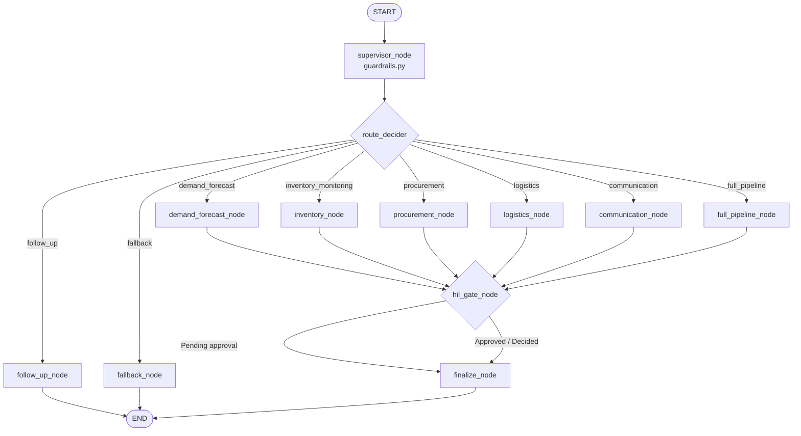
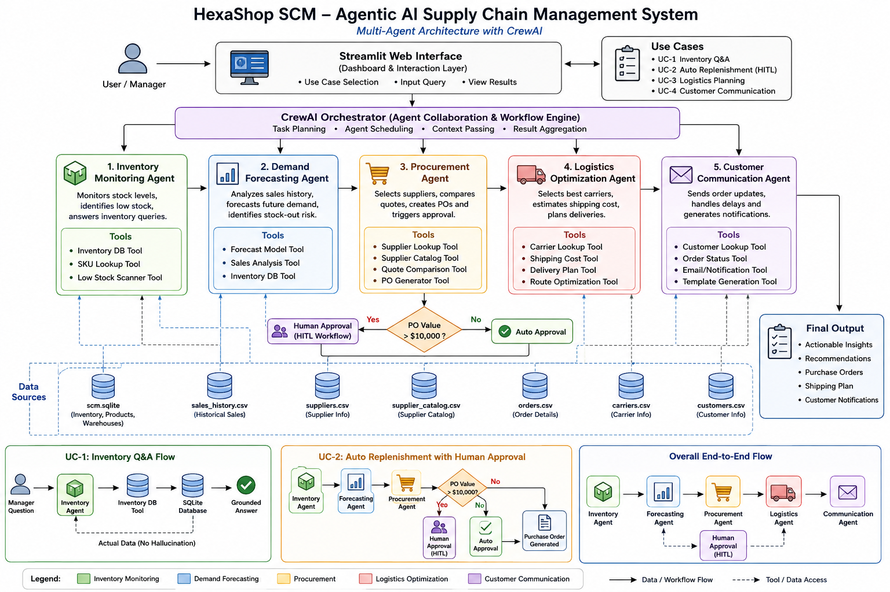
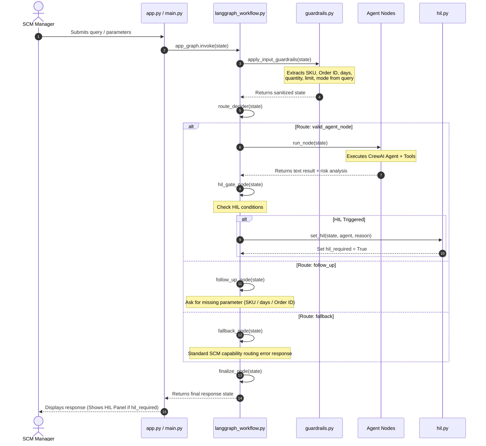

# HexaShop SCM Multi-Agent Streamlit Application

[](#)
[](#)
[](#)
[](#)

An enterprise-grade, multi-agent supply chain management system for HexaShop. It combines the structured workflow steering of **LangGraph** with the execution capabilities of **CrewAI** specialists, featuring robust input guardrails, Human-in-the-Loop approvals, and comprehensive audit logging.

---

## Project Overview

> [!NOTE]
> This SCM application coordinates multi-agent decision workflows. It automatically parses user intent, routes tasks to specialized domain agents, checks for business risk thresholds, schedules human reviews when safety guardrails are crossed, and logs every step.

```text
┌────────────────────────────────────────────────────────┐
│                   LangGraph Supervisor                 │
│    (Determines intent, extracts SKU/Order, sanitizes)  │
└───────────────────────────┬────────────────────────────┘
                            │ (Routes using Keyword Regex)
   ┌────────────────────────┼────────────────────────┐
   ▼                        ▼                        ▼
[Demand Forecast]    [Inventory Monitor]        [Procurement] ...
(CrewAI Agent)       (CrewAI Agent)             (CrewAI Agent)
   │                        │                        │
   └────────────────────────┼────────────────────────┘
                            ▼
                    [HIL Gate Node]
     (Pauses execution if threshold values exceeded)
                            ▼
                 [Final Response Node]
```

---

## Architecture Diagram


### LangGraph SCM Routing Architecture

Below is the logical routing architecture of the LangGraph supervisor workflow.



*Place custom visual asset below:*

<!-- ARCHITECTURE DIAGRAM PLACEHOLDER: Paste your image link below -->


---

## Technology Stack

| Technology | Role in Project | Scope & Components | File References |
| :--- | :--- | :--- | :--- |
| **Streamlit** | Dashboard Frontend | Input widgets, routing status, logs viewer, HIL approval controls | [app.py](file:///p:/GenAI%20Training/Practice%20Environment/capstone/SEM-AGENTIC-AI/hexashop_app/app.py) |
| **LangGraph** | Orchestration | State management, conditional routing, loop gates | [langgraph_workflow.py](file:///p:/GenAI%20Training/Practice%20Environment/capstone/SEM-AGENTIC-AI/hexashop_app/langgraph_workflow.py) |
| **CrewAI** | Specialist Agents | Execution tasks with specific backstories, roles, and tools | `agents/` and `agent_wrappers/` |
| **Azure OpenAI** | LLM Engine | Model reasoning (`azure/` model wrapper via dotenv configs) | [common.py](file:///p:/GenAI%20Training/Practice%20Environment/capstone/SEM-AGENTIC-AI/hexashop_app/agent_wrappers/common.py) |
| **SQLite** | Database | Relational inventory and product SKU records | [scm.sqlite](file:///p:/GenAI%20Training/Practice%20Environment/capstone/SEM-AGENTIC-AI/hexashop_app/data/scm.sqlite) |
| **pandas** | Data Analysis | Carrier lookups, sales forecasting calculations, CSV parsing | `tools/` and `agents/` |

---

## Project Structure

The codebase is organized into modules segregating agents, tools, prompt configs, and data assets:

```text
hexashop_app/
├── app.py                    # Streamlit Dashboard UI layout & view components
├── main.py                   # Command Line Interface (CLI) application runner
├── langgraph_workflow.py     # LangGraph workflow compilation & node logic definitions
├── state.py                  # Global TypedDict definition (SCMState)
├── guardrails.py             # Parameter extraction regex & intent router
├── hil.py                    # Human-in-the-loop injection & state decider
├── logger_config.py          # Unified plain text & JSONL logger
├── requirements.txt          # Python library dependencies
│
├── agents/                   # CrewAI Agents
│   ├── demand_forecast_agent.py
│   ├── inventory_monitoring_agent.py
│   ├── procurement_agent.py
│   ├── logistics_routing_agent.py
│   └── communication_agent.py
│
├── agent_wrappers/           # LangGraph adapters for CrewAI execution
│   ├── common.py             # Shared wrappers (LLM initialization, data helper)
│   ├── demand_wrapper.py
│   ├── inventory_wrapper.py
│   ├── procurement_wrapper.py
│   ├── logistics_wrapper.py
│   └── communication_wrapper.py
│
├── tools/                    # Deterministic backend function bindings
│   ├── demand_forecast_tools.py
│   ├── inventory_monitoring_tools.py
│   ├── procurement_tools.py
│   └── logistics_routing_tools.py
│
├── prompts/                  # Text-engineered prompts for LLMs
│   ├── demand_forecast_prompts.py
│   ├── inventory_monitoring_prompts.py
│   ├── procurement_prompts.py
│   ├── logistics_routing_prompts.py
│   └── communication_prompts.py
│
└── data/                     # Database files, catalogs, and logs
    ├── scm.sqlite            # Inventory & products DB
    ├── pending_approvals.json# Log of pending PO actions requiring review
    ├── sales_history.csv     # sales data for forecast model calculation
    ├── carriers.json         # Shipping providers availability & ETA parameters
    └── supplier_catalog.json # Supplier stock limits & unit costs
```

---

## Agent Overview Matrix

| Agent | CrewAI Role | Core Goal | Backstory Context | Config Reference |
| :--- | :--- | :--- | :--- | :--- |
| **Demand Forecast** | `Demand Forecasting Analyst` | Predict near-term demand from sales records & identify stock-out/overstock risk. | Senior Analyst looking at historical patterns to warn about impending stock out. | [demand_forecast_prompts.py](file:///p:/GenAI%20Training/Practice%20Environment/capstone/SEM-AGENTIC-AI/hexashop_app/prompts/demand_forecast_prompts.py) |
| **Inventory Monitor** | `Inventory Monitoring Agent` | Monitor warehouse stock levels & identify items below reorder points. | Watchdog agent dedicated to sqlite inventory database verification. | [inventory_monitoring_prompts.py](file:///p:/GenAI%20Training/Practice%20Environment/capstone/SEM-AGENTIC-AI/hexashop_app/prompts/inventory_monitoring_prompts.py) |
| **Procurement** | `Senior Procurement & Supplier Specialist` | Pick ideal suppliers, optimize order costs, and build structured Purchase Orders (PO). | Experienced negotiator comparing unit prices, lead times, and reliability. | [procurement_prompts.py](file:///p:/GenAI%20Training/Practice%20Environment/capstone/SEM-AGENTIC-AI/hexashop_app/prompts/procurement_prompts.py) |
| **Logistics** | `Logistics and Routing Specialist` | Route pending customer orders through carriers using cost, speed, and location. | Logistics master coordinating shipping plans based on weight, cost, and ETA. | [logistics_routing_prompts.py](file:///p:/GenAI%20Training/Practice%20Environment/capstone/SEM-AGENTIC-AI/hexashop_app/prompts/logistics_routing_prompts.py) |
| **Communication** | `Customer Communication Specialist` | Draft professional customer update emails and summarize high-risk events. | Customer relations specialist writing polite delay notifications and cancellations. | [communication_prompts.py](file:///p:/GenAI%20Training/Practice%20Environment/capstone/SEM-AGENTIC-AI/hexashop_app/prompts/communication_prompts.py) |

---

## Workflow Diagram

Detailed operational sequence for query execution:



---

## Tools & Responsibilities

| Tool | Binding Style | Assigned Agent | Inputs | Primary Functionality |
| :--- | :--- | :--- | :--- | :--- |
| **`forecast_model`** | CrewAI `@tool` | Demand Forecast | `sku: str, days: int` | Calculates average of last 7 days sales and multiplies by forecast range. |
| **`inventory_db_lookup`** | CrewAI `@tool` | Demand Forecast | `sku: str` | Checks current database stock levels to assign risk tag. |
| **`inventory_db`** | CrewAI `@tool` | Inventory Monitor | `question: str` | Executes hardcoded SELECT queries based on filters (e.g. "North" region). |
| **`low_stock_scanner`** | CrewAI `@tool` | Inventory Monitor | None | Finds all products in database where `on_hand < reorder_point`. |
| **`sku_profile`** | CrewAI `@tool` | Inventory Monitor | `sku: str` | Queries products catalog metadata (category, weight, brand, base cost). |
| **`SupplierTool`** | Class `BaseTool` | Procurement | `sku: str, quantity: int` | Searches catalog to select supplier with lowest cost and highest reliability. |
| **`CalculatorTool`** | Class `BaseTool` | Procurement | `unit_cost, quantity` | Evaluates total transaction cost (`unit_cost * quantity`). |
| **`ApprovalTool`** | Class `BaseTool` | Procurement | `purchase_order: dict` | If total cost > limit, queues PO to `pending_approvals.json`. |
| **`shipping_api_tool`** | CrewAI `@tool` | Logistics | `limit: int, mode: str` | Matches pending orders with carriers based on ETA, weight limits, and costs. |

---

## Installation Guide

Follow these steps to set up and run the application locally:

- [ ] **Clone the workspace repository**
  ```bash
  git clone <repository-url>
  cd hexashop_app
  ```

- [ ] **Set up a Python Virtual Environment**
  ```bash
  python -m venv venv
  ```

- [ ] **Activate the Virtual Environment**
  * Windows PowerShell:
    ```powershell
    .\venv\Scripts\Activate.ps1
    ```
  * Git Bash / Linux:
    ```bash
    source venv/Scripts/activate
    ```

- [ ] **Install Required Package Dependencies**
  ```bash
  pip install -r requirements.txt
  ```

- [ ] **Configure Local Environment Settings**
  Create a `.env` file in the root directory (using `.env.example` as a template) and add your Azure OpenAI service variables.

---

## Environment Variables

> [!WARNING]
> Ensure all Azure OpenAI variables are correctly defined. Incorrect settings will result in execution exceptions during agent initialization.

| Environment Variable | Variable Type | Default Value | Purpose | Reference File |
| :--- | :--- | :--- | :--- | :--- |
| `AZURE_OPENAI_ENDPOINT` | String | `None` | Azure OpenAI resource endpoint URL | [common.py](file:///p:/GenAI%20Training/Practice%20Environment/capstone/SEM-AGENTIC-AI/hexashop_app/agent_wrappers/common.py) |
| `AZURE_OPENAI_KEY` | String | `None` | Endpoint API credentials key | [common.py](file:///p:/GenAI%20Training/Practice%20Environment/capstone/SEM-AGENTIC-AI/hexashop_app/agent_wrappers/common.py) |
| `AZURE_OPENAI_DEPLOYMENT` | String | `None` | Name of model deployment | [common.py](file:///p:/GenAI%20Training/Practice%20Environment/capstone/SEM-AGENTIC-AI/hexashop_app/agent_wrappers/common.py) |
| `AZURE_OPENAI_API_VERSION` | String | `2024-12-01-preview` | Version of the deployment API | [common.py](file:///p:/GenAI%20Training/Practice%20Environment/capstone/SEM-AGENTIC-AI/hexashop_app/agent_wrappers/common.py) |
| `HIGH_FORECAST_MULTIPLIER` | Float | `1.5` | Demand multiplier vs reorder quantity for HIL | [demand_forecast_agent.py](file:///p:/GenAI%20Training/Practice%20Environment/capstone/SEM-AGENTIC-AI/hexashop_app/agents/demand_forecast_agent.py) |
| `CRITICAL_SHORTAGE_LIMIT` | Integer | `50` | Shortage threshold that triggers HIL check | [inventory_monitoring_agent.py](file:///p:/GenAI%20Training/Practice%20Environment/capstone/SEM-AGENTIC-AI/hexashop_app/agents/inventory_monitoring_agent.py) |
| `PROCUREMENT_APPROVAL_LIMIT` | Float | `100000.0` | Max order cost limit for auto-approval | [procurement_tools.py](file:///p:/GenAI%20Training/Practice%20Environment/capstone/SEM-AGENTIC-AI/hexashop_app/tools/procurement_tools.py) |
| `MAX_SHIPMENT_WEIGHT_KG` | Float | `100.0` | Limit for individual shipment weight (kg) | [logistics_routing_tools.py](file:///p:/GenAI%20Training/Practice%20Environment/capstone/SEM-AGENTIC-AI/hexashop_app/tools/logistics_routing_tools.py) |
| `HIGH_SHIPPING_COST_LIMIT` | Float | `5000.0` | Shipping cost threshold for HIL review | [logistics_routing_tools.py](file:///p:/GenAI%20Training/Practice%20Environment/capstone/SEM-AGENTIC-AI/hexashop_app/tools/logistics_routing_tools.py) |
| `CREWAI_TRACING_ENABLED` | Boolean | `false` | Enable or disable CrewAI tracing | [main.py](file:///p:/GenAI%20Training/Practice%20Environment/capstone/SEM-AGENTIC-AI/hexashop_app/main.py) |
| `OTEL_SDK_DISABLED` | Boolean | `true` | Disable OpenTelemetry SDK console metrics | [main.py](file:///p:/GenAI%20Training/Practice%20Environment/capstone/SEM-AGENTIC-AI/hexashop_app/main.py) |

---

## Running the Application

### Option A: Streamlit Dashboard UI

Launch the Streamlit dashboard in your web browser:

```bash
streamlit run app.py
```

*Dashboard Tabs:*
- **Ask SCM Agent**: Enter SCM queries, view outputs, and process HIL approvals.
- **Logs**: Real-time visualization of `scm_runs.jsonl` audit traces.
- **Help / Test Questions**: List of copy-pasteable commands for system evaluation.

---

### Option B: Terminal CLI Runner

Interact with the SCM graph via standard command line interface:

```bash
python main.py
```

*CLI properties:*
- Submits inputs to the SCM graph, printing outputs to stdout.
- Redirects CrewAI verbose logging output to `logs/crew_output.log` to keep the console clean.
- Shows alerts when HIL approvals are required.

---

## Features & Capabilities Matrix

| SCM Operation | Primary Agent | Key Inputs | HIL Trigger Criteria | Action Taken on HIL |
| :--- | :--- | :--- | :--- | :--- |
| **Demand Forecasting** | Demand Forecast | SKU, Days | 1. Predicted demand > on-hand inventory<br/>2. SKU is already in stock-out risk<br/>3. Predicted demand > reorder quantity * Multiplier | Pauses workflow for manager review of the forecast. |
| **Inventory Monitoring** | Inventory Monitor | Query string | Shortage `(reorder_point - on_hand)` >= `CRITICAL_SHORTAGE_LIMIT` | Flags severe SKU shortage; requests manager confirmation. |
| **Procurement** | Procurement Agent | SKU, Quantity | Total purchase cost exceeds `PROCUREMENT_APPROVAL_LIMIT` | Saves PO status as `PENDING_HUMAN_APPROVAL` to `pending_approvals.json`. |
| **Logistics** | Logistics Routing | Mode, Order Limit | 1. Estimated carrier delay risk<br/>2. Cost > `HIGH_SHIPPING_COST_LIMIT`<br/>3. Total weight > `MAX_SHIPMENT_WEIGHT_KG` | Holds shipping plan; status shows as `PENDING_MANAGER_APPROVAL`. |
| **Communication** | Communication Agent| Order ID | Priority is `HIGH` (Premium Tier customer + Delayed or Cancelled order status) | Holds customer email draft for review before sending. |

---

## Logging & Monitoring

The application logs all actions to the following directory structure:

```text
logs/
├── scm_agent.log      # Plaintext logger outputting structured INFO statements
├── scm_runs.jsonl     # JSON-Lines audit trail containing run details, routes, and outcomes
└── crew_output.log    # Redirected CrewAI command verbose outputs
```

### JSONL Log Record Schema

```json
{
  "timestamp": "2026-07-06T16:15:30",
  "event_type": "agent_result",
  "agent": "procurement",
  "hil_required": true,
  "reason": "Purchase order requires manager approval."
}
```

---

## Guardrails

### Input Parameters Extraction
The supervisor extracts parameters from user queries using regex patterns:
- **SKU**: Matches pattern `\b[A-Z]{2,5}-\d{3,5}\b` (e.g., `ELC-1001`).
- **Order ID**: Matches pattern `\bORD[-_]?\d{3,6}\b` (e.g., `ORD-90017`).
- **Days**: Matches patterns like `for X days`, `next X days`, or `X day forecast`.
- **Quantity**: Matches patterns like `quantity X`, `qty X`, or `procure X`.
- **Logistics Mode**: Detects `fastest`, `cheapest`, or `balanced` keywords.
- **Order Limit**: Parses integer limits for pending order requests.

### Interactive Follow-up Prompting
If input values required by an agent are missing, the workflow prompts the user:
* **Demand Forecast Node**: Prompts if SKU or days parameters are missing.
* **Communication Node**: Prompts if Order ID is missing.

---

## Use Cases

<details>
<summary><b>Use Case 1: Demand Forecasting</b></summary>

### 📈 Use Case 1: Demand Forecasting

*   **Sample Queries:**
    *   `Forecast demand for ELC-1001 for 7 days`
    *   `Check stock-out risk for FSH-2001 for 10 days`
*   **Routing Logic:** Routed to `demand_forecast` by `route_query()` in [guardrails.py](file:///p:/GenAI%20Training/Practice%20Environment/capstone/SEM-AGENTIC-AI/hexashop_app/guardrails.py).
*   **Agent Execution:** Uses [demand_forecast_agent.py](file:///p:/GenAI%20Training/Practice%20Environment/capstone/SEM-AGENTIC-AI/hexashop_app/agents/demand_forecast_agent.py) which runs deterministic functions `_forecast_model_logic` and `_inventory_lookup_logic`.
*   **HIL Conditions:**
    *   Predicted demand > on-hand inventory.
    *   `HIGH_FORECAST_MULTIPLIER` exceeded.
*   **Output Details:**
    *   Average daily sales.
    *   Total forecasted units.
    *   Stock risk evaluation.

</details>

<details>
<summary><b>Use Case 2: Inventory Monitoring</b></summary>

### 🔍 Use Case 2: Inventory Monitoring

*   **Sample Queries:**
    *   `Show all low stock products below reorder level`
    *   `Which SKUs are below reorder level in the North warehouse?`
    *   `Show SKU profile for ELC-1001`
*   **Routing Logic:** Routed to `inventory_monitoring` by [guardrails.py](file:///p:/GenAI%20Training/Practice%20Environment/capstone/SEM-AGENTIC-AI/hexashop_app/guardrails.py).
*   **Agent Execution:** Runs [inventory_monitoring_agent.py](file:///p:/GenAI%20Training/Practice%20Environment/capstone/SEM-AGENTIC-AI/hexashop_app/agents/inventory_monitoring_agent.py) checking relational data in `scm.sqlite`.
*   **HIL Conditions:**
    *   Any shortage amount >= `CRITICAL_SHORTAGE_LIMIT` (default 50).
*   **Output Details:**
    *   Itemized SKU details, warehouse, region, shortage count, and profile parameters.

</details>

<details>
<summary><b>Use Case 3: Procurement & Supplier Selection</b></summary>

### 🛒 Use Case 3: Procurement

*   **Sample Queries:**
    *   `Create procurement plan for low stock items`
    *   `Find best supplier for ELC-1001 quantity 120`
    *   `Generate purchase order for HOM-3001 quantity 200`
*   **Routing Logic:** Routed to `procurement` by [guardrails.py](file:///p:/GenAI%20Training/Practice%20Environment/capstone/SEM-AGENTIC-AI/hexashop_app/guardrails.py).
*   **Agent Execution:** Runs [procurement_agent.py](file:///p:/GenAI%20Training/Practice%20Environment/capstone/SEM-AGENTIC-AI/hexashop_app/agents/procurement_agent.py) with access to catalog JSON and supplier parameters CSV.
*   **HIL Conditions:**
    *   Purchase order total cost > `PROCUREMENT_APPROVAL_LIMIT`.
*   **Output Details:**
    *   PO identifier, selected supplier metadata (reliability, location), computed costs, and approval status.

</details>

<details>
<summary><b>Use Case 4: Logistics Carrier Routing</b></summary>

### 🚚 Use Case 4: Logistics & Routing

*   **Sample Queries:**
    *   `Create balanced logistics plan for 10 pending orders`
    *   `Choose fastest carrier for 5 pending orders`
    *   `Check delay risk for all pending orders using cheapest mode`
*   **Routing Logic:** Routed to `logistics` by [guardrails.py](file:///p:/GenAI%20Training/Practice%20Environment/capstone/SEM-AGENTIC-AI/hexashop_app/guardrails.py).
*   **Agent Execution:** Runs [logistics_routing_agent.py](file:///p:/GenAI%20Training/Practice%20Environment/capstone/SEM-AGENTIC-AI/hexashop_app/agents/logistics_routing_agent.py) with database pending order rows and carrier parameters.
*   **HIL Conditions:**
    *   Weight > `MAX_SHIPMENT_WEIGHT_KG`.
    *   Carrier cost > `HIGH_SHIPPING_COST_LIMIT`.
    *   Promised delivery date < shipping ETA.
*   **Output Details:**
    *   Carriers optimization score, aggregate plan costs, average ETA, tracking ID registry, and status flags.

</details>

<details>
<summary><b>Use Case 5: Customer Communication</b></summary>

### ✉️ Use Case 5: Customer Communication

*   **Sample Queries:**
    *   `Generate customer communication for order ORD-90017`
    *   `Draft customer email for delayed order ORD-90018`
*   **Routing Logic:** Routed to `communication` by [guardrails.py](file:///p:/GenAI%20Training/Practice%20Environment/capstone/SEM-AGENTIC-AI/hexashop_app/guardrails.py).
*   **Agent Execution:** Runs [communication_agent.py](file:///p:/GenAI%20Training/Practice%20Environment/capstone/SEM-AGENTIC-AI/hexashop_app/agents/communication_agent.py), mapping tier information and order status.
*   **HIL Conditions:**
    *   Priority evaluated as `HIGH` (delayed/cancelled status for Premium Tier customer).
*   **Output Details:**
    *   Polite email subject draft, customized body message, and manager summary block.

</details>

<details>
<summary><b>SCM Pipeline: End-to-End Analysis</b></summary>

### 🔄 Use Case 6: Full SCM Pipeline

*   **Sample Queries:**
    *   `Run full end-to-end SCM workflow for ELC-1001 for 7 days`
    *   `Run complete HexaShop supply chain analysis`
*   **Routing Logic:** Routed to `full_pipeline` by [guardrails.py](file:///p:/GenAI%20Training/Practice%20Environment/capstone/SEM-AGENTIC-AI/hexashop_app/guardrails.py).
*   **Agent Execution:** Runs multiple nodes sequentially in the graph:
    1.  Calculates demand forecast for the requested SKU and days.
    2.  Scans the database for all low-stock items.
    3.  Creates procurement recommendations and drafts POs for replenishing low-stock items.
    4.  Runs the logistics optimizer to plan shipping for the pending orders.
    5.  Generates customer updates if an `order_id` is supplied.
*   **HIL Conditions:**
    *   Evaluates HIL criteria at each step. If any step triggers a review, the entire pipeline flags `hil_required = True`.
*   **Output Details:**
    *   A consolidated, multi-section report in markdown summarizing demand forecast, low stock warnings, replenishment POs, logistics dispatch schedules, and customer emails.

</details>
